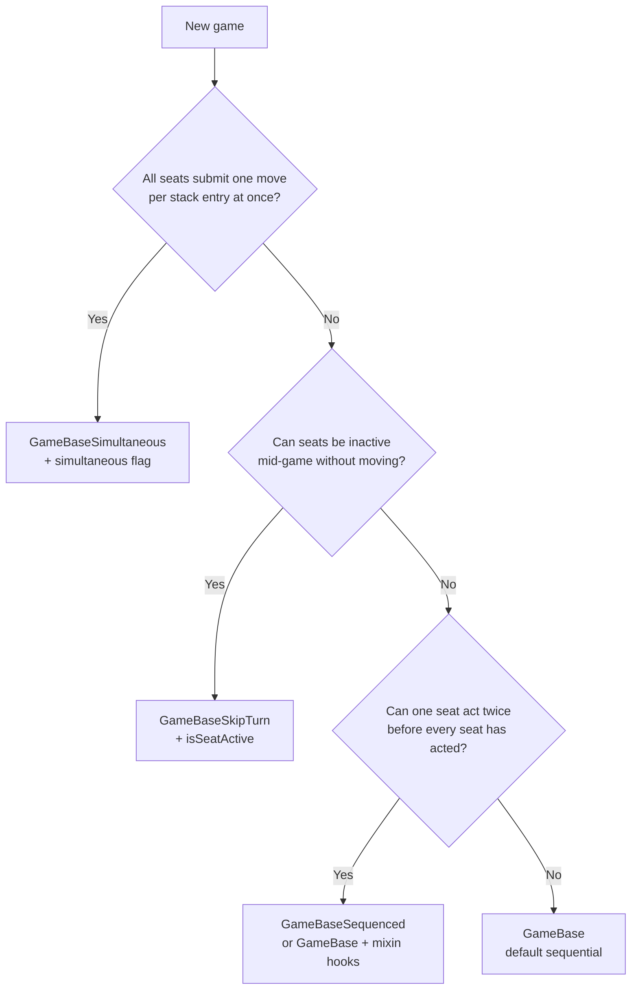

# Creating games

Guide for adding a new game to gameslib. For API details see [Game object](/gameslib/game-object/) and [Helpers](/gameslib/helpers/).

## Workflow

1. **Fork** [gameslib](https://github.com/AbstractPlay/gameslib) and work on the `develop` branch.
2. Before first `npm install`, run `npm run npm-login` for GitHub Packages access.
3. **Choose a base class** (see below) and **create** `src/games/<uid>.ts`.
4. **Run** `npm run generate-registry` (or any build/test) — the game registry is auto-generated from `static gameinfo`.
5. **Add i18n** strings to `locales/en/apgames.json` (and `apresults.json` if needed).
6. **Flag** new games with `experimental` in `gameinfo`.
7. **Test** locally — [Testing](/gameslib/testing/).
8. **PR** against `develop`; test on [play.dev.abstractplay.com](https://play.dev.abstractplay.com) after merge.

## Choosing a base class

This is one of the first decisions when authoring a game. The base class controls how **`getPlies()` / `getRounds()`** group stack entries for **published gamerecord export** and how the **finished-game move table** lays out columns (via `header["turn-model"]` and `engine.turnModel()`).

It does **not** change how you implement `move()` day-to-day unless your rules genuinely need different turn structure. Pick the class that matches **who acts on each `saveState()`** and **how rounds close**.

### Quick decision guide



### Base classes at a glance

| Base class | `turnModel()` | One stack entry = | Round closes when | Example games |
|------------|---------------|-------------------|-------------------|---------------|
| **`GameBase`** | `"sequential"` | One ply by one seat | Every `numplayers` plies (or every ply at 1p) | [Complica](https://play.abstractplay.com/games/complica), [Hex](https://play.abstractplay.com/games/hex), [Frogger](https://play.abstractplay.com/games/frogger) without `refills` |
| **`GameBaseSimultaneous`** | `"simultaneous"` | One **round** (all seats) | Each stack entry is one round | [Robo Battle Pigs](https://play.abstractplay.com/games/pigs), [Entropy](https://play.abstractplay.com/games/entropy) |
| **`GameBaseSkipTurn`** | `"skip-turn"` | One ply by one **active** seat | Seat cycle wraps to round opener | [Armadas](https://play.abstractplay.com/games/armadas), [Homeworlds](https://play.abstractplay.com/games/homeworlds) |
| **`GameBaseSequenced`** | `"sequenced"` | One ply (same as sequential) | Seat cycle wraps (not fixed ply count) | Future: Gnostica; use when **every** game uses sequenced export |

**Solo games (`numplayers === 1`):** always use **`GameBase`**. Skip-turn, simultaneous, and sequenced base classes do not apply; each ply closes its own round automatically.

### What each turn model means for export

| `turnModel()` | Move table / record shape | When you need it |
|---------------|---------------------------|------------------|
| **`sequential`** | Fixed alternation: row *i* seat *j* ≈ ply *i×N+j* (legacy stride). Default for strict round-robin. | Turns advance seat 1 → 2 → … → 1 with **exactly one ply per seat per cycle**. |
| **`simultaneous`** | One row per stack entry; columns are comma-split moves per seat. `null` or `\u0091` for eliminated seats. | Everyone submits together each round (set `simultaneous` in `gameinfo.flags`). |
| **`skip-turn`** | Full-width rows; **`null`** where a seat did not act (eliminated / inactive). | Turn order skips seats that cannot act (elimination, no ships, no homeworld). Implement **`isSeatActive(seat, stackIndex)`**. |
| **`sequenced`** | **Sparse rows**: often **one ply per row**, move in the actor’s column; `{ move, sequence }` when play order ≠ seating. | A seat may act **more than once** before the cycle completes (refill follow-ups, branch depth). |

Setting **`turnModel()` alone is not enough** for sequenced export — you also need **`shouldCloseRound`**, and usually **sparse `getRounds()`** (see [Game object — mixin hooks](/gameslib/game-object/#mixin-hooks-plyactor-shouldcloseround)). `GameBaseSequenced` bundles those defaults. For a worked example (including Frogger-style two actions in one round), see **[Sequenced turn model](/gameslib/sequenced-turn-model/)**.

### Worked examples

#### `GameBase` — strict round-robin (most games)

[Complica](https://play.abstractplay.com/games/complica): each `move()` advances `currplayer`; one stack entry per submit; P1 then P2 then P1…

```ts
export class ComplicaGame extends GameBase {
  // No turn-model overrides needed.
}
```

#### `GameBaseSimultaneous` — one stack entry per round

[Pigs](https://play.abstractplay.com/games/pigs): `lastmove` is `"moveP1,moveP2,moveP3,moveP4"` (comma-separated). One `saveState()` per round.

- Set **`simultaneous`** in `gameinfo.flags` (see [Flags](/gameslib/flags/)).
- Extend **`GameBaseSimultaneous`**.
- Eliminated seats export as **`null`** (or legacy `\u0091` in old records).

#### `GameBaseSkipTurn` — inactive seats, null columns

[Armadas](https://play.abstractplay.com/games/armadas) 3p+: when a player loses all ships, they stop acting but other seats continue. Export must show **`null`** in that column, not a mis-assigned move.

```ts
export class ArmadasGame extends GameBaseSkipTurn {
  protected isSeatActive(seat: number, stackIndex: number): boolean {
    // true iff seat had at least one ship before stack[stackIndex]
  }
}
```

2p Armadas degenerates to no nulls (all seats always active) but still uses `GameBaseSkipTurn`.

#### Sequenced export — consecutive plies by one seat

**[Frogger](https://play.abstractplay.com/games/frogger)** with the **`refills`** variant is the reference case: one seat announces a refill (`!`), then submits again on the **next ply** before the seat cycle continues. Sequenced export puts both moves in that seat’s column — **without** fake `pass` plies for other seats.

Full walkthrough (recommended `refillPending` shape, hooks, tests): **[Sequenced turn model](/gameslib/sequenced-turn-model/)**.

Summary:

- **New game, always sequenced** → `extends GameBaseSequenced`; override `shouldCloseRound` while a supplemental obligation is open.
- **Variant-gated (Frogger refactor)** → gate `turnModel()` and sparse export on `refills`; replace legacy `skipto` / pass chains with explicit pending state (see doc). Shipped Frogger still uses `_turn-sequenced-skipto` until that refactor lands.

#### `GameBase` + hooks — variant-gated or special-case

Use **`GameBase`** with protected overrides when turn structure depends on a **variant** or a one-off rule (Frogger refills pattern above). Do **not** create a new base class for every game.

### Mixin hooks (all bases)

These protected methods on **`GameBase`** are the extension points when the stock base class is close but not exact:

| Hook | Default | Override when |
|------|---------|---------------|
| **`plyActor(stackIndex)`** | `stack[stackIndex - 1].currplayer` | Actor is not the pre-move `currplayer` (unusual; prefer fixing `currplayer` in `move()`). |
| **`shouldCloseRound(roundPlies, stackIndex)`** | Close every `numplayers` plies | Round ends on **seat-cycle wrap**, not fixed ply count; or while supplemental obligation still open (`refillPending`). |
| **`getRounds()`** | Pack plies into `numplayers`-wide rows | Consecutive plies by one seat would **overwrite** in `buildRoundRow` — emit **one row per ply** instead. |
| **`compactExportRounds()`** | Trim trailing `null` seats | Skip-turn / simultaneous / sequenced sparse rows must keep full width. |
| **`turnModel()`** | `"sequential"` (or base class default) | Consumer hint for replay and UI; must match export shape. |

Full detail: [Game object — mixin hooks](/gameslib/game-object/#mixin-hooks-plyactor-shouldcloseround).

### Common mistakes

- **Overriding `moveHistory()` or `getMoveList()`** to fix export layout — use **`getRounds()` / mixin hooks** and **`recordExportExclude()`** instead. `moveHistory()` stays frozen for bots and legacy tests.
- **Using `GameBaseSimultaneous`** because the game has a `simultaneous` flag in metadata but is actually turn-based — the flag and base class must match real stack shape.
- **Only setting `turnModel()` to `"sequenced"`** without sparse `getRounds()` — the header will say sequenced but export will still mis-pack moves.
- **Subclassing `GameBaseSkipTurn` for “sequenced” reordering** — skip-turn is for **absence** (`null`), not extra actions by an active seat.

## Implementation checklist

- [ ] `static readonly gameinfo: APGamesInformation` (flag `experimental` must be set for all new games)
- [ ] **Base class** chosen (`GameBase`, `GameBaseSimultaneous`, `GameBaseSkipTurn`, or `GameBaseSequenced`) — see above
- [ ] **`simultaneous` flag** in `gameinfo` iff using `GameBaseSimultaneous`
- [ ] **`isSeatActive`** iff using `GameBaseSkipTurn`
- [ ] State interfaces (`IMoveState`, `I<Name>State`)
- [ ] Constructor (new + deserialize via `reviver`)
- [ ] `move`, `render`, `state`, `load`, `clone`, `moveState`
- [ ] `recordExportExclude()` only if published records should omit extra `_results` types beyond `eog` / `winners` (see [Game object — record export](/gameslib/game-object/#turn-model-and-record-export))
- [ ] `moves()` unless using `no-moves` flag
- [ ] `handleClick` for interactive placement
- [ ] `validateMove` / `checkEOG` as needed
- [ ] Unit tests under `test/games/`
- [ ] Renderer JSON validated against [renderer schema](/renderer/schema-reference/)

Start from [/gameslib/templates/new-game-template.ts](/gameslib/templates/new-game-template.ts) and [Complica](https://play.abstractplay.com/games/complica).

## Choosing helpers

Most board games use either:

- **`RectGrid`** — rectangular boards with directions and algebraic coords ([Hnefatafl](https://play.abstractplay.com/games/tafl), [Go](https://play.abstractplay.com/games/go))
- **Graph classes** — hex, snubsquare, sowing, etc. ([Helpers overview](/gameslib/helpers/))

Use the [examples by feature](/gameslib/examples/by-feature/) index to find games similar to yours.

## Renderer

Implement `render(opts?)` returning `APRenderRep` for `@abstractplay/renderer`. Prototype JSON in the [renderer playground](https://renderer.dev.abstractplay.com).

## Example games

| Pattern | Game |
|---------|------|
| Default sequential | [Complica](https://play.abstractplay.com/games/complica), [Hex](https://play.abstractplay.com/games/hex) |
| Simultaneous rounds | [Robo Battle Pigs](https://play.abstractplay.com/games/pigs), [Entropy](https://play.abstractplay.com/games/entropy) |
| Skip-turn / elimination | [Armadas](https://play.abstractplay.com/games/armadas), [Homeworlds](https://play.abstractplay.com/games/homeworlds) |
| Sequenced / duplicate actor per round | [Sequenced turn model](/gameslib/sequenced-turn-model/) · [Frogger](https://play.abstractplay.com/games/frogger) (`refills`) |
| Hex graph | [Yavalath](https://play.abstractplay.com/games/yavalath) |
| Custom `recordExportExclude` | [Volcano](https://play.abstractplay.com/games/volcano), [Tablero](https://play.abstractplay.com/games/tablero) |
