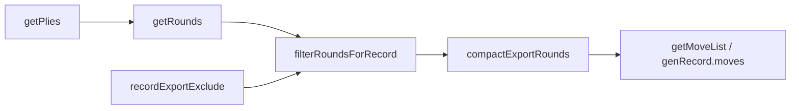

# Game object

Every game is a class extending one of the `GameBase` hierarchy:

| Base class | `turnModel()` | When to use |
|------------|---------------|-------------|
| `GameBase` | `"sequential"` | Default — one stack entry per ply; turns advance in seat order |
| `GameBaseSimultaneous` | `"simultaneous"` | One stack entry per round; `lastmove` is comma-split per seat (Pigs, Entropy, …) |
| `GameBaseSkipTurn` | `"skip-turn"` | Inactive seats skipped in turn order; `null` in export for eliminated players (Armadas, Homeworlds) |
| `GameBaseSequenced` | `"sequenced"` | Seat may act **multiple times** before the cycle completes; sparse one-row-per-ply export (optional sugar — see mixin hooks) |

See **[Creating games — Choosing a base class](/gameslib/creating-games/#choosing-a-base-class)** for a decision guide and worked examples.

## Required abstract methods

| Method | Purpose |
|--------|---------|
| `move(m, opts?)` | Apply a move string; return updated game |
| `render(opts?)` | Return `APRenderRep` (or array) for the renderer |
| `state(opts?)` | Return `IAPGameState` snapshot |
| `load(idx)` | Load stack position (default: latest) |
| `clone()` | Deep copy |
| `moveState()` | Snapshot for pushing onto stack (protected) |

`GameBaseSkipTurn` also requires `isSeatActive(seat, stackIndex)` — whether a 1-based seat may act at the pre-move state for `stack[stackIndex]`.

### Mixin hooks (`plyActor`, `shouldCloseRound`)

All bases inherit overridable hooks from `GameBase` (implemented in `_turn-plies.ts` and base `getRounds()`). Override these when turn structure is **not** strict round-robin but you are **not** using skip-turn nulls or simultaneous comma-moves:

| Hook | Default behaviour |
|------|-------------------|
| `plyActor(stackIndex)` | Actor = `stack[stackIndex - 1].currplayer` |
| `shouldCloseRound(roundPlies, stackIndex)` | Close every `numplayers` plies (every ply when `numplayers === 1`) |
| `getRounds()` | Pack plies into `numplayers`-wide rows via `buildRoundRow` |
| `compactExportRounds()` | Trim trailing `null` seats per row (sequential export) |

**`GameBaseSequenced`** sets `turnModel()` → `"sequenced"`, uses seat-cycle `shouldCloseRound`, sparse `getRounds()` (one row per ply), and skips trailing-null compaction. See **[Sequenced turn model](/gameslib/sequenced-turn-model/)** for a full example (duplicate actions per round, round-close rules, Frogger `refills`).

**[Frogger](https://play.abstractplay.com/games/frogger)** (`refills` variant) is migrating to this model; shipped code still uses legacy stack `skipto` via [`_turn-sequenced-skipto.ts`](/gameslib/src/games/_turn-sequenced-skipto.ts). See **[Sequenced turn model](/gameslib/sequenced-turn-model/)** for the target refactor shape.

Do **not** override `moveHistory()` for export fixes — bots and legacy tests depend on the frozen stride shape.

## State shape (`IAPGameState`)

```ts
{
  game: string;        // uid
  numplayers: number;
  variants: string[];
  gameover: boolean;
  winner: number[];
  stack: IIndividualState[];
}
```

You typically don't need to alter `IAPGameState`, but if there is game-wide information you need to store (information that doesn't change move to move), this is the most efficient place to store it.

Each `IIndividualState` requires `_version`, `_results`, `_timestamp`. The rest is up to the game itself. It's really up to the developer how they want to structure things. As long as the game code will correctly hydrate a saved state, you're good.

## Provided by `GameBase`

Serialization: `serialize()`, `undo()`, `resign()`, `timeout()`, `draw()`, `abandoned()`.

**Flags:** `getFlags()` returns effective flags for this session (variant and player-count aware). Override `static resolveFlags(context)` on the game class when flags depend on context. See [Flags](/gameslib/flags/). Session capability (`getFlags()` includes `pie` / `pie-even`) is separate from turn phase (`isPieTurn()`, `isKomiTurn()` on individual games).

UI: `handleClick()`, `moves()`, `validateMove()`, `sidebarStatuses()`, `sidebarScores()`, `getButtons()` (when flagged). Sidebar status/score labels use structured `RenderLabel` objects (`seatStatusValue()`, `neutralAreaLabel()`); front resolves them at display time. See **[Structured render labels](/gameslib/structured-render-labels/#sidebar-status)**.

History and records: `moveHistory()`, `getPlies()`, `getRounds()`, `recordExportExclude()`, `resultsHistory()`, `chatLog()`, `chat()`, `genRecord()`.

## Turn model and record export

There are two related layers:

1. **Canonical turn structure** — `getPlies()` / `getRounds()` walk the stack with ply-correct round boundaries. Slots include full `_results` (no export filtering).
2. **Published gamerecord** — `genRecord().moves` comes from the export pipeline below.



### `getPlies()` and `getRounds()`

- **`getPlies()`** — flat list of plies with `actor`, `move`, `results`, `round`, `playOrder`, `stackIndex`.
- **`getRounds()`** — seating-indexed rows (`IGameRound`), one entry per player seat per round. A slot is a move string, `{ move, result? }`, `{ move, sequence, result? }`, or `null` when that seat did not act (eliminated / inactive).

Simultaneous and skip-turn games keep **full row width** (including `null` columns); sequential games may trim trailing `null` seats in export only.

### `recordExportExclude()`

Override this protected hook to control which `_results.type` values are **stripped from published move slots** in `genRecord().moves`. It does **not** change `getRounds()` — only the export copy.

**Default** (no override needed for most games):

```ts
protected recordExportExclude(): string[] {
    return ["eog", "winners"];
}
```

`eog` and `winners` are already in the gamerecord header; omitting them from per-move `result` arrays avoids duplication.

**When to override:** your game previously used `getMoveList()` → `getMovesAndResults([...exclude])` to hide annotation types from the published record (e.g. per-move `move`, `place`, `capture` objects that duplicate the move string). Copy the **same type list** into `recordExportExclude()` — do **not** override `getMoveList()`.

Example (Volcano — omits move annotations from export):

```ts
protected recordExportExclude(): string[] {
    return ["move", "eog", "winners"];
}
```

Example (Tablero — several annotation types):

```ts
protected recordExportExclude(): string[] {
    return ["place", "take", "pass", "eog", "winners"];
}
```

**Do not override `getMoveList()`** for export filtering. The default implementation is:

```ts
protected getMoveList(): any[] {
    return this.compactExportRounds(
        this.filterRoundsForRecord(this.getRounds(), this.recordExportExclude()),
    );
}
```

Only override `getMoveList()` if export row **shape** must differ from `getRounds()` after filtering (rare; Armadas 3+ used to be an example — now handled by `GameBaseSkipTurn` + `buildRoundRow`).

### `genRecord()` header

`genRecord()` sets `header["turn-model"]` from `turnModel()` (Phase 4). Values: `sequential`, `simultaneous`, `sequenced`, `skip-turn`. Recranks and stats consumers use this to replay sequenced/skip-turn rounds and count null-aware move totals; legacy records without the header keep stride replay and `rec.moves.length`.

### `moveHistory()` (frozen)

Legacy stride-based grouping (`i += numplayers`). Still used by bots, AiAi, and some golden tests. **Not** the source for `genRecord().moves` after the Phase 1b export pipeline.

Do not override `moveHistory()` to fix record export — use `getRounds()` / `recordExportExclude()` instead.

### `getMovesAndResults()` (deprecated for export)

Frozen stride shim for old code paths. New games should not call it. Migrating games: replace `getMoveList() { return this.getMovesAndResults([...]); }` with `recordExportExclude()` only.

## `IRenderOpts`

Optional `render()` arguments: `perspective`, `altDisplay`, `hideLayer`. Games with `stacking-expanding` pass click coordinates through render options.

### Render labels

Area and board `label` fields may be plain strings or structured `RenderLabel` objects (`textKey`, optional `textParams`, optional `actor`). Use **`seatAreaLabel(seat, textKey)`** on `GameBase` for player-owned pieces areas; front resolves usernames and i18n at draw time. Full guide: **[Structured render labels](/gameslib/structured-render-labels/)**.

## `IClickResult`

Returned by `handleClick`: `valid`, `message`, `move`, optional `complete` and `canrender`.

## Example games

- **[Complica](https://play.abstractplay.com/games/complica)** — full `GameBase` lifecycle; default `recordExportExclude()`
- **[Volcano](https://play.abstractplay.com/games/volcano)** — `recordExportExclude()` omits `move` annotations from export
- **[Homeworlds](https://play.abstractplay.com/games/homeworlds)** — `GameBaseSkipTurn`; `null` export slots for eliminated seats
- **[Robo Battle Pigs](https://play.abstractplay.com/games/pigs)** — `GameBaseSimultaneous`; one stack entry per round
- **[Frogger](https://play.abstractplay.com/games/frogger)** — `refills` variant: sequenced export (see [Sequenced turn model](/gameslib/sequenced-turn-model/)); legacy `skipto` until refactor

## Solo play (`numplayers === 1`)

Solo titles use ordinary `GameBase` with `turnModel: "sequential"` — there is no `SoloGameBase`. A class may serve both solo and multiplayer (`playercounts: [1, 2, …]`); solo-only paths activate when `numplayers === 1`.

### Outcome types

Declare the outcome model via `getSoloOutcomeMeta()`:

| `outcome-type` | Record fields | Score source |
|----------------|---------------|--------------|
| `binary` | `passed` (boolean), optional `score` | `getPlayerScore()` + `getBinaryPassed()` |
| `graded` | `grade` (tier id), `score` | `getPlayerScore()` + `getGradeTiers()` |
| `score` | `score` only | `getPlayerScore()` |
| `timed` | `score` = elapsed ms | `getPlayerElapsedMs()` (stack timestamps) |

Games must declare `score-direction` (`higher` or `lower`) for binary, graded, and score. **`timed` always archives `score-direction: lower`** (faster is better).

Types and helpers live in [`_solo-outcome.ts`](/gameslib/src/games/_solo-outcome.ts): `evaluateGrade()`, `computeElapsedMs()`, `soloScoreDirection()`.

### Seeded RNG (`GameRng`)

New solo games that need deterministic puzzles use [`GameRng`](/gameslib/src/common/rng.ts) (`seedrandom.alea`) — **not** unseeded `Math.random()`.

| Step | Contract |
|------|----------|
| Create | `challengeSeed` optional; `resolveChallengeSeed()` / `generateChallengeSeed()` assign one before play |
| Setup | `initRng(seed)` before any random event |
| Play | Pass `this.rng` to `randomInt()` / `shuffle()` / `Deck.shuffle(rng)` |
| Save | `saveState()` snapshots `rngCounter` on each stack entry (via `attachSoloStateFields`) |
| Load | `restoreSoloRngFromEntry(stack[idx])` after copying board state |
| Archive | `genRecord()` writes `header["challenge-seed"]` when present |

**Strategy A (persist outcomes):** store rolls, draw-pile order (`drawPile` / `serializeDrawOrder()`), etc. on stack entries — do not re-roll on `load()`.

**Strategy B (RNG stream):** `rngCounter` on stack entries enables catch-up without replaying all prior draws.

`randomInt` and `shuffle` accept an optional `GameRng`; default remains `Math.random()` so shipped multiplayer games need no changes.

### Replay helpers

[`replay.ts`](/gameslib/src/common/replay.ts): `replayToStackIndex()` and `assertReplayMatches()` for tests and recranks validation.

### Move-handler rules (solo)

| Rule | Why |
|------|-----|
| Never call `randomInt` / `shuffle` when `emulation: true` | Preview must not advance RNG |
| Never reroll if `stack[idx].roll` already set | Dice games |
| Never `shuffle()` in `load()` if draw order on stack | Deck games |
| Consume RNG only on committed moves | Optional rolls / stymie |

Canoe `syncFromStackEntry()` + emulation tests are the reference pattern for dice — inspiration only; do not retrofit shipped multiplayer titles.

### `genRecord()` solo header (additive)

- `outcome-type`, `score-direction`, optional `score-label`
- `challenge-seed` when solo RNG is in use
- `players[0].passed` (binary), `players[0].grade` (graded), `players[0].score` (raw numeric; timed = ms)

Solo EOG uses `{type: "eog"}` plus outcome fields — not `{type: "winners"}` as the primary narrative.

### Structured move log (`chatLogEntries`)

Structured move logs separate **who spoke** (`ChatActorRef`) from **what was said** (i18n `textKey` / `textParams`), so consumers substitute display names and style automated actors at render time. Full guide: **[Structured move log](/gameslib/structured-chat-log/)**.

| Export | Role |
|--------|------|
| `ChatActorRef`, `ChatLogLine`, `ChatLogEntry`, `ChatLogCollectContext` | Types in [`chat-log.ts`](/gameslib/src/common/chat-log.ts) |
| `formatChatLogEntries`, `formatChatLogEntryNodes` | Resolve `textKey` / label actors at display time |
| `chatPlayerToken`, `applyChatPlayerNames` | Seat lines embed `Player N`; only seat actors get display-name substitution |

**Game hooks**

- `chatLogEntries(players)` — walk `stack` and emit structured lines. Default on `GameBase` handles standard `apresults:*` result types.
- `collectChatLogLine(lines, r, ctx)` — emit structured lines per result; override for game-specific result types (always delegate unhandled types to `super`).
- `pushSeatChatLine` / `pushNeutralChatLine` — protected helpers; emit i18n keys, not translated strings.
- `getChatActorRef(seat)` — default `{ kind: "seat", seat }`; override for non-human seats (label actor with `apresults:` i18n key).
- `resolveChatSeat(r, currplayer)` — default `currplayer - 1` (wrap); override when the first result encodes the frame actor.

Override `chatLogEntries` for simultaneous indexing or aggregated frames — see the guide.

**Consumer integration (playground / front)**

1. Call `formatChatLogEntryNodes(game.chatLogEntries(playerNames), playerNames, t)` (or `formatChatLogEntries` for a flat list).
2. For solo (`numplayers === 1`), pass one human display name — do not map seat `2` to a second player name.
3. Optional: render `line.actor.kind` in the UI for label/neutral styling.
